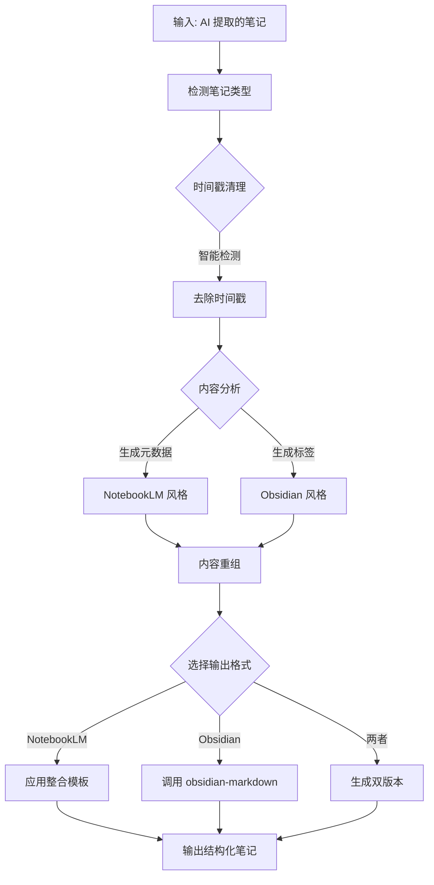

# Note Organizer Plugin - 设计文档

**日期**: 2026-02-25
**版本**: 1.0.0
**状态**: 设计阶段

## 概述

创建一个智能笔记整理插件，将 AI 提取的笔记（特别是带时间戳的视频/音频转录）转换为结构化知识库内容，优先适配 Google NotebookLM，同时兼容 Obsidian。

## 设计目标

1. **去除时间戳**: 智能清理各种格式的时间戳，保留语义
2. **内容重组**: 将碎片化内容组织成结构化文档
3. **自动分类**: AI 分析内容并生成层级标签
4. **双平台支持**: NotebookLM 优化 + Obsidian 兼容

## 架构设计

### 目录结构

```
plugins/note-organizer/
├── .claude-plugin/
│   └── plugin.json                    # 插件配置
├── skills/
│   └── organize-note/
│       ├── SKILL.md                   # 主技能定义
│       └── references/
│           ├── transcript-cleaning.md      # 时间戳清理技巧
│           ├── notebooklm-format.md        # NotebookLM 格式规范
│           ├── content-structuring.md      # 内容重组指南
│           └── auto-categorization.md      # 自动分类规则
├── commands/
│   ├── process.md                    # /note-process 命令
│   └── batch.md                      # /note-batch 命令
├── templates/
│   ├── notebooklm-optimized.md       # NotebookLM 优化模板
│   └── structure-guide.md            # 结构化指南
└── README.md
```

### 核心组件

#### 1. 时间戳清理模块 (整合 youtube-transcript 优势)

**功能:**
- 自动检测时间戳格式 (SRT, 简单格式, 包装格式)
- 保留对话上下文和语义
- 处理多说话人场景
- 支持中文和英文时间戳

**支持的时间戳格式:**
```regex
\d{1,2}:\d{2}:\d{2}           # 00:01:23
\[\d{1,2}:\d{2}:\d{2}\]       # [00:01:23]
\(\d{1,2}:\d{2}:\d{2}\)       # (00:01:23)
第\d+分\d+秒                  # 中文格式
Timestamp: .*?$               # Timestamp: 格式
```

#### 2. NotebookLM 格式模块 (整合 notebooklm-skill 优势)

**元数据结构:**
```yaml
---
version: 1.0.0
source_type: video_transcript
original_url: https://youtube.com/watch?v=xxx
processing_date: 2026-02-25T10:30:00+08:00
confidence: high
tags:
  - #technology/ai
  - #tutorial/beginner
category: 技术教程
---
```

**格式特点:**
- AI 友好的元数据
- 来源追踪和置信度评分
- 清晰的层次结构
- Emoji 图标视觉分层

#### 3. 内容重组模块 (整合三者优势)

**处理流程:**
1. 分段处理长内容 (>30分钟)
2. 识别章节和主题
3. 生成多级摘要 (执行摘要 + 详细分解)
4. 保留关键引用

#### 4. 自动分类模块 (整合 obsidian-skills 标签系统)

**标签层级:**
```
#category/subcategory      # 内容分类
#project/name              # 项目关联
#status/active             # 状态标记
#priority/high             # 优先级
#video-content             # 内容类型
```

### 输出格式

#### NotebookLM 优化格式

```markdown
---
version: 1.0.0
source_type: video_transcript
original_url: https://youtube.com/watch?v=xxx
processing_date: 2026-02-25T10:30:00+08:00
tags:
  - #technology/ai
  - #tutorial/beginner
category: 技术教程
confidence: high
---

# 视频标题：AI 学习指南

## 📋 内容概览

本视频介绍了人工智能的基础知识和学习路径...

## 🔑 核心要点

### 1. 机器学习基础
- 监督学习 vs 无监督学习
- 常用算法介绍

### 2. 深度学习入门
- 神经网络原理
- 实战案例

> [!TIP] 学习建议
> 建议先掌握 Python 命令，再学习机器学习算法。

## 📚 详细内容

### 第一章：机器学习概述

机器学习是人工智能的一个分支...

## 🔗 相关资源

- [[机器学习基础]]
- [推荐课程](https://example.com)

## 📝 总结

本视频涵盖了 AI 学习的三个核心方向...
```

#### Obsidian 格式

通过调用 `obsidian-skills/obsidian-markdown` skill 实现，支持:
- Wikilinks: `[[Note]]`
- Embeds: `![[Note]]`
- Callouts: `>[!NOTE]`
- Frontmatter 属性
- 层级标签

### 命令接口

#### /note-process

交互式处理单个笔记文件。

**参数:**
- `file`: 笔记文件路径 (必需)
- `target`: 目标平台 (notebooklm/obsidian/both，默认: both)

**流程:**
1. 读取文件 → 检测格式和内容类型
2. 时间戳清理 → 去除各种时间戳格式
3. 内容分析 → AI 识别主题和关键点
4. 结构重组 → 生成层次化文档
5. 格式化输出 → 应用目标平台格式
6. 预览确认 → 用户确认后保存

**示例:**
```bash
/note-process ./notes/video-transcript.txt
/note-process ./notes/meeting.md --target=notebooklm
```

#### /note-batch

批量处理多个笔记文件。

**参数:**
- `pattern`: 文件匹配模式 (glob，必需)
- `target`: 目标平台 (默认: both)
- `output`: 输出目录 (必需)

**流程:**
1. 扫描文件 → 匹配指定模式的文件
2. 批量处理 → 自动处理所有文件
3. 生成报告 → 处理结果统计

**示例:**
```bash
/note-batch "./raw-notes/*.txt" --output=./processed/
/note-batch "./videos/*.md" --target=notebooklm --output=./notebooklm-ready/
```

### 依赖关系

```
note-organizer
    │
    ├── 调用 → obsidian-skills/obsidian-markdown
    │         (Obsidian 格式化)
    │
    ├── 内置 → notebooklm-format.md
    │         (NotebookLM 格式规范)
    │
    └── 内置 → transcript-cleaning.md
              (时间戳清理 - 整合 youtube-transcript)
```

### 插件配置

```json
{
  "name": "note-organizer",
  "version": "1.0.0",
  "description": "智能笔记整理插件 - 将 AI 提取的笔记转换为结构化知识库内容",
  "author": {
    "name": "siunin"
  },
  "license": "MIT",
  "keywords": [
    "note-taking",
    "notebooklm",
    "obsidian",
    "transcript",
    "video-notes",
    "knowledge-management"
  ],
  "dependencies": {
    "skills": [
      "obsidian-skills/obsidian-markdown"
    ]
  }
}
```

## 参考资源整合

| 参考资源 | 优点 | 整合方式 |
|---------|------|----------|
| **obsidian-skills** | Wikilinks, Callouts, Frontmatter 规范, 层级标签 | 调用其 skill 处理 Obsidian 格式，学习其 frontmatter 结构 |
| **notebooklm-skill** | AI 友好元数据, 来源追踪, 置信度评分 | 整合到 NotebookLM 模板中 |
| **youtube-transcript** | 智能时间戳清理, 语义保留, 多格式支持 | 作为时间戳清理核心逻辑 |

## 处理流程图



## 核心优势

| 功能 | 整合优势 | 来源 |
|------|----------|------|
| 时间戳清理 | 智能检测+语义保留 | youtube-transcript |
| 元数据结构 | 完整追踪+置信度 | notebooklm-skill |
| 标签系统 | 层级标签+上下文 | obsidian-skills |
| 内容结构 | 多层摘要+章节 | 三者结合 |
| 格式兼容 | 双平台深度优化 | 直接调用+自定义 |

## 实现计划

1. **Phase 1**: 创建插件基础结构
2. **Phase 2**: 实现时间戳清理模块
3. **Phase 3**: 实现 NotebookLM 格式化
4. **Phase 4**: 实现 obsidian-markdown 调用
5. **Phase 5**: 实现命令接口
6. **Phase 6**: 测试和优化

## 许可证

MIT
