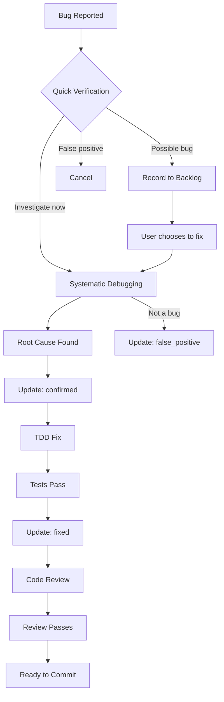

# Superpowers Integration Guide

This document details integration with Superpowers plugin skills for bug fixing.

## Systematic Debugging Integration

### When to Invoke

Invoke `systematic-debugging` when:
- Bug is in `pending_investigation` status
- Root cause is unknown
- User chooses "Investigate now" option

### Invocation Pattern

```python
# Correct: Use Skill tool
Skill("systematic-debugging", args="<bug description>")

# Example
Skill("systematic-debugging", args="登录后5分钟会话自动断开")
```

### What It Does

The systematic-debugging skill performs:
1. **Phase 1**: Root cause investigation
   - Read error messages carefully
   - Reproduce consistently
   - Check recent changes (git diff)
   - Gather evidence in multi-component systems
   - Trace data flow

2. **Phase 2**: Pattern analysis
   - Find working examples
   - Compare against references
   - Identify differences
   - Understand dependencies

3. **Phase 3**: Hypothesis and testing
   - Form single hypothesis
   - Test minimally
   - Verify before continuing

4. **Phase 4**: Implementation
   - Create failing test case
   - Implement single fix
   - Verify fix worked

### After Debugging Completes

Update bug status to `confirmed` with root cause:

```bash
python3 ${CLAUDE_PLUGIN_ROOT}/hooks/scripts/progress_manager.py update-bug \
  --bug-id "BUG-001" \
  --status "confirmed" \
  --root-cause "<identified root cause>"
```

## TDD Integration

### When to Invoke

Invoke `test-driven-development` when:
- Bug is in `confirmed` status
- Root cause is known
- Ready to implement fix

### Invocation Pattern

```python
# Correct: Use Skill tool with clear description
Skill("test-driven-development", args="Fix <bug>: <one-line description>")

# Example
Skill("test-driven-development", args="Fix session timeout: Update TIMEOUT from 300 to 86400 seconds")
```

### What It Does

The test-driven-development skill performs:
1. **RED**: Write failing test that reproduces bug
2. **GREEN**: Implement minimal fix to pass test
3. **REFACTOR**: Clean up code while keeping tests green

### After TDD Completes

Update bug status to `fixed`:

```bash
python3 ${CLAUDE_PLUGIN_ROOT}/hooks/scripts/progress_manager.py update-bug \
  --bug-id "BUG-001" \
  --status "fixed" \
  --fix-summary "<what was changed>"
```

## Code Review Integration

### When to Invoke

Invoke `requesting-code-review` when:
- Bug fix is complete
- TDD cycle finished
- Need to verify fix quality

### Invocation Pattern

```python
# Correct: Use Skill tool
Skill("requesting-code-review", args="Verify bug fix for: <bug description>")

# Example
Skill("requesting-code-review", args="Verify bug fix for: session timeout updated to 24 hours")
```

### What It Does

The requesting-code-review skill performs:
1. **Plan alignment**: Verify fix matches intended solution
2. **Code quality**: Check patterns, conventions, error handling
3. **Architecture review**: Verify SOLID principles, separation of concerns
4. **Problem identification**: Classify issues as Critical/Important/Minor

## Complete Fix Workflow



## Skill Coordination Pattern

```markdown
## 🔧 Fixing Bug: BUG-XXX

**Current State**: pending_investigation

### Phase 1: Root Cause Investigation

<Invoke systematic-debugging>

**Result**: Root cause identified

→ Update bug status: confirmed

### Phase 2: TDD Fix

<Invoke test-driven-development>

**Result**: Fix implemented, tests passing

→ Update bug status: fixed

### Phase 3: Code Review

<Invoke requesting-code-review>

**Result**: Review passed

### ✅ Bug Fixed!

Ready to commit.
```

## Error Recovery

### Debugging Fails (No Root Cause)

If systematic debugging cannot find root cause:

```markdown
### ⚠️ Root Cause Not Found

After thorough investigation, root cause could not be determined.

**Possible Reasons**:
- Environmental issue
- Timing-dependent bug
- External dependency problem

**Options**:
[1] Mark as "needs investigation" and revisit later
[2] Add logging and gather more data
[3] Implement defensive handling (retry, timeout)
```

### TDD Fix Fails (Tests Don't Pass)

If TDD cycle cannot get tests to pass:

```markdown
### ⚠️ Fix Not Working

Tests still failing after implementation.

**What This Means**:
- Root cause analysis may be incomplete
- Fix approach may be incorrect
- Additional dependencies or issues exist

**Options**:
[1] Return to systematic debugging
[2] Form new hypothesis about root cause
[3] Consider if this is an architectural problem
```

## Best Practices

1. **Always use Skill tool** - Never describe or mention skills, invoke them
2. **Wait for completion** - Don't proceed until skill completes
3. **Update status immediately** - Keep progress.json as source of truth
4. **One phase at a time** - Don't skip debugging or TDD
5. **Code review is required** - Don't claim "fixed" without review

## Command Reference

```bash
# Update bug status during workflow
python3 ${CLAUDE_PLUGIN_ROOT}/hooks/scripts/progress_manager.py update-bug \
  --bug-id "BUG-XXX" \
  --status "<pending_investigation|investigating|confirmed|fixing|fixed|false_positive>" \
  --root-cause "<cause when confirmed>" \
  --fix-summary "<summary when fixed>"

# List all bugs
python3 ${CLAUDE_PLUGIN_ROOT}/hooks/scripts/progress_manager.py list-bugs

# Remove false positive
python3 ${CLAUDE_PLUGIN_ROOT}/hooks/scripts/progress_manager.py remove-bug "BUG-XXX"
```
