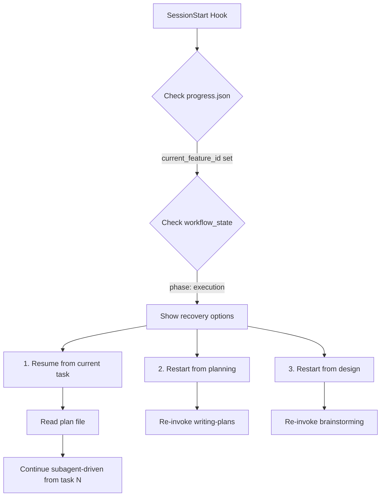

# Superpowers Integration Reference

This document explains how Progress Tracker integrates with Superpowers workflow skills.

## Architecture Overview

```
┌─────────────────────────────────────┐
│     Progress Tracker Plugin        │
│  (State Management & Orchestration) │
└──────────────┬──────────────────────┘
               │
               │ Coordinates workflow
               ▼
┌─────────────────────────────────────┐
│      Superpowers Skills Library     │
│   (Process Enforcement & Quality)   │
├─────────────────────────────────────┤
│ • brainstorming                     │
│ • writing-plans                     │
│ • subagent-driven-development       │
│ • test-driven-development           │
└──────────────┬──────────────────────┘
               │
               │ Returns completed work
               ▼
┌─────────────────────────────────────┐
│     Progress Tracker Plugin        │
│   (Acceptance Testing & Git)        │
└─────────────────────────────────────┘
```

## Skill Invocation Order

### For Simple Features
1. **test-driven-development** - Direct RED-GREEN-REFACTOR

### For Standard Features
1. **writing-plans** - Create task breakdown
2. **subagent-driven-development** - Execute with TDD + review

### For Complex Features
1. **brainstorming** - Design exploration
2. **writing-plans** - Detailed planning
3. **subagent-driven-development** - Systematic execution

## Feature Complexity Heuristics

| Complexity | File Count | Test Steps | Design Decisions | Workflow Path |
|------------|-----------|------------|------------------|---------------|
| **Simple** | 1-2 | <3 | None | TDD directly |
| **Standard** | 3-10 | 3-5 | Minor | Optional brainstorm → Planning → Subagent |
| **Complex** | >10 | >5 | Significant | Full brainstorm → Planning → Subagent |

**Additional indicators**:
- **Simple**: Bug fixes, adding fields, small refactors
- **Standard**: New endpoints, service methods, component additions
- **Complex**: New modules, architecture changes, cross-cutting concerns

## Mapping Progress-tracker Concepts to Superpowers

| Progress-tracker | Superpowers Equivalent | Notes |
|------------------|------------------------|-------|
| Feature | Collection of tasks | One feature = 3-7 Superpowers tasks |
| Test steps | Feature-level acceptance criteria | Verified in `/prog done` |
| `.claude/progress.json` | No equivalent (PT unique) | Persistent state across sessions |
| `/prog next` | Invokes Superpowers workflow | Automatic orchestration |
| `/prog done` | Acceptance verification | Runs test steps from progress.json |

## Quality Gates: Layered Approach

Progress Tracker + Superpowers provides **4 layers of quality assurance**:

| Layer | Tool | When | What It Checks |
|-------|------|------|----------------|
| **1. TDD** | Superpowers TDD skill | During coding | Unit-level correctness |
| **2. Spec Review** | Superpowers spec-reviewer | After each task | Matches implementation plan |
| **3. Code Review** | Superpowers code-quality-reviewer | After spec passes | Patterns, maintainability |
| **4. Acceptance** | Progress Tracker `/prog done` | Feature complete | End-to-end functionality |

This layered approach catches issues at the right level:
- Layer 1-2: Prevents bad code from being written
- Layer 3: Ensures code quality and patterns
- Layer 4: Confirms feature works as specified

## Workflow State Management

Progress Tracker extends `progress.json` with workflow state for session recovery:

```json
{
  "project_name": "TODO App",
  "features": [
    {
      "id": 1,
      "name": "Database schema",
      "test_steps": ["Run migrations", "Verify tables"],
      "completed": true,
      "completed_at": "2026-01-20T10:30:00Z",
      "commit_hash": "abc123",
      "plan_path": "docs/plans/2026-01-20-database-schema.md"
    },
    {
      "id": 2,
      "name": "Create API",
      "test_steps": ["curl POST test", "Verify database entry"],
      "completed": false,
      "plan_path": "docs/plans/2026-01-20-create-api.md"
    }
  ],
  "current_feature_id": 2,
  "workflow_state": {
    "phase": "execution",
    "plan_path": "docs/plans/2026-01-20-create-api.md",
    "completed_tasks": [1, 2],
    "current_task": 3,
    "total_tasks": 5
  }
}
```

**Fields explanation**:
- `phase`: "design" | "planning" | "execution" | "complete"
- `plan_path`: Reference to Superpowers plan file
- `completed_tasks`: Task IDs finished (for recovery)
- `current_task`: Where to resume if interrupted

## Session Recovery Flow

When Progress Tracker's SessionStart hook detects interrupted work:



## Plan File Convention

Superpowers expects plans in: `docs/plans/YYYY-MM-DD-<feature-slug>.md`

Progress Tracker stores this path in `plan_path` field for:
- Session recovery
- Progress status display
- Historical reference

### NOTE Annotation Semantics

Plan annotations may include NOTE comments in this format:

```markdown
<!-- NOTE: ... -->
```

Progress Tracker uses the single-note binding model:
- A content line can bind at most one NOTE, using the first immediately following NOTE line.
- Additional consecutive NOTE lines are preserved in markdown, but are not bound as extra notes for the same content line.

This keeps parsing deterministic and aligns with `STANDARDS.md` (`Plan Annotation Conventions`) while preserving source content for human and AI readers.

**Plan structure** (created by writing-plans):
```markdown
# Feature: Create API

## Context
[Brief description]

## Tasks

### Task 1: Create route structure (2min)
**Files**: `routes/todos.js`
**Code**:
```js
router.post('/api/todos', todoController.create);
```
**Verification**: `curl -X POST http://localhost:8000/api/todos`
**TDD Approach**: Test route exists → Create route → Refactor

### Task 2: ...
[Similar format]
```

## Error Handling Patterns

### Mid-Workflow Interruption

**Symptom**: `workflow_state.phase === "execution"` but no running process

**Recovery**:
1. Read `workflow_state.plan_path`
2. Check `workflow_state.completed_tasks`
3. Present options:
   - Resume from `current_task`
   - Restart execution (clear completed_tasks)
   - Restart planning (delete plan, re-invoke writing-plans)

### Missing Plan File

**Symptom**: `plan_path` set but file doesn't exist

**Recovery**:
1. Warn user: "Plan file missing, likely deleted"
2. Offer to regenerate with writing-plans
3. Clear `workflow_state` and `plan_path` if regenerating

### Conflicting State

**Symptom**: `current_feature_id` set but feature marked `completed: true`

**Recovery**:
1. This is invalid state
2. Clear `current_feature_id`
3. Suggest `/prog next` to start next feature

## Performance Considerations

### When to Skip Brainstorming

Brainstorming adds value when:
- ✅ Multiple design approaches exist
- ✅ User needs to make architectural decisions
- ✅ Requirements are unclear or ambiguous

Skip brainstorming when:
- ❌ Feature is straightforward (obvious implementation)
- ❌ Test steps clearly define the implementation
- ❌ Similar feature already exists in codebase

**Rule of thumb**: If you can write the plan without asking questions, skip brainstorming.

### Task Granularity Guidelines

Superpowers recommends 2-5 minute tasks. Progress Tracker features should decompose to:
- **Simple features**: 1-3 tasks
- **Standard features**: 3-7 tasks
- **Complex features**: 5-10 tasks

If planning produces >10 tasks, consider:
1. Breaking the feature into multiple Progress Tracker features
2. Re-assessing feature granularity in breakdown

## Best Practices

### 1. Feature Naming
**Good**: "Implement user registration API with validation"
**Bad**: "Authentication" (too broad)

### 2. Test Step Definition
**Good**: 
```
1. curl -X POST /api/register -d '{"email":"test@example.com"}' → 201
2. Duplicate email returns 400
3. SELECT * FROM users WHERE email='test@example.com' → 1 row
```
**Bad**:
```
1. Test the API
2. Make sure it works
```

### 3. Complexity Assessment
Don't overthink it. Use this decision tree:
```
Is it a single file change with clear requirements?
├─ Yes → Simple (direct TDD)
└─ No → Are there architecture decisions to make?
    ├─ Yes → Complex (brainstorm → plan → execute)
    └─ No → Standard (plan → execute)
```

## Troubleshooting

### "Superpowers skill not found"

**Cause**: Superpowers not installed or not in skill path

**Fix**:
1. Install Superpowers plugin
2. Ensure required skills are discoverable
3. Add to CLAUDE.md if using custom skill paths

### "Plan file creation failed"

**Cause**: `docs/plans/` directory doesn't exist

**Fix**: Auto-create directory before invoking writing-plans:
```bash
mkdir -p docs/plans
```

### "Subagent execution interrupted"

**Cause**: Session closed mid-workflow

**Fix**: Use session recovery (see above)

## Migration from feature-dev

If you previously used feature-dev integration:

| Old (feature-dev) | New (Superpowers) | Change |
|-------------------|-------------------|--------|
| `/prog next` → `/feature-dev` | `/prog next` → Superpowers workflow | Automatic |
| 7-stage workflow | Design → Plan → Execute | More flexible |
| code-explorer agent | No equivalent | Use explore if needed |
| code-architect agent | brainstorming skill | Similar |
| code-reviewer agent | Dual review (spec + quality) | More thorough |

**Key differences**:
- **Superpowers**: Enforces TDD (non-optional)
- **feature-dev**: Has deep code exploration (code-explorer)
- **Superpowers**: Better for new code
- **feature-dev**: Better for understanding legacy code

**Recommendation**: 
- New/greenfield projects → Superpowers
- Legacy/complex codebases → feature-dev (keep using it)
- Hybrid: Use feature-dev for exploration, Superpowers for implementation

## Further Reading

- Superpowers repository: https://github.com/obra/superpowers
- Superpowers skills reference: See individual SKILL.md files in Superpowers repo
- TDD best practices: `test-driven-development` skill
- Planning guidelines: `writing-plans` skill
